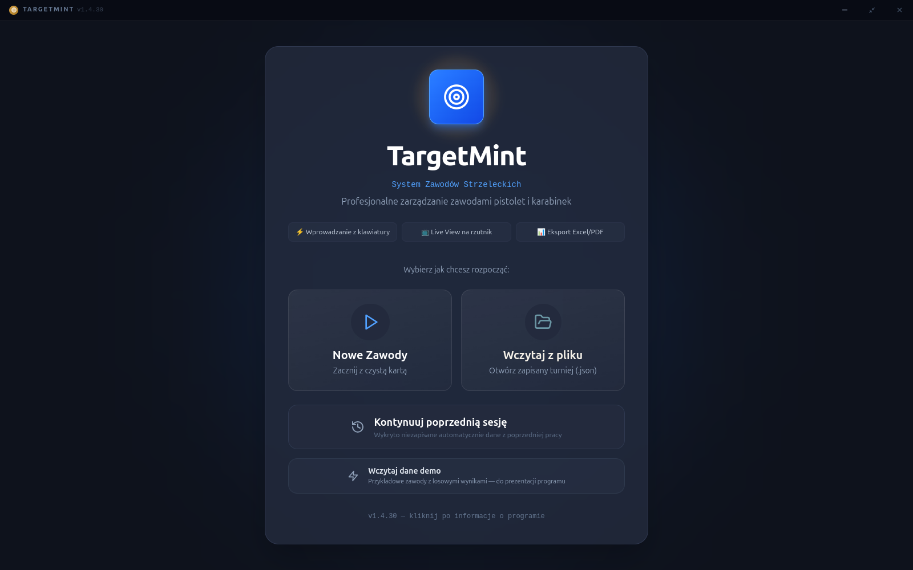
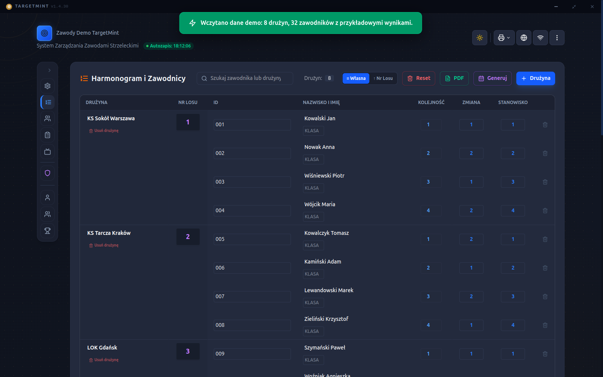
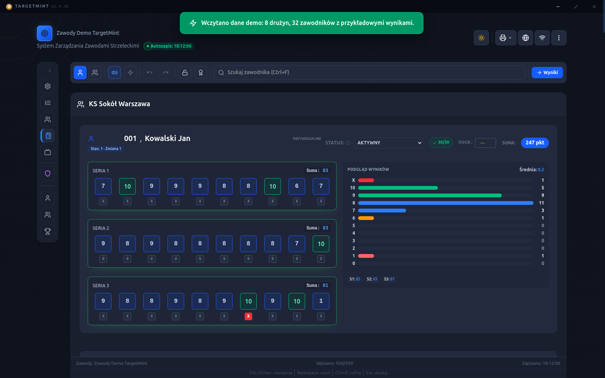
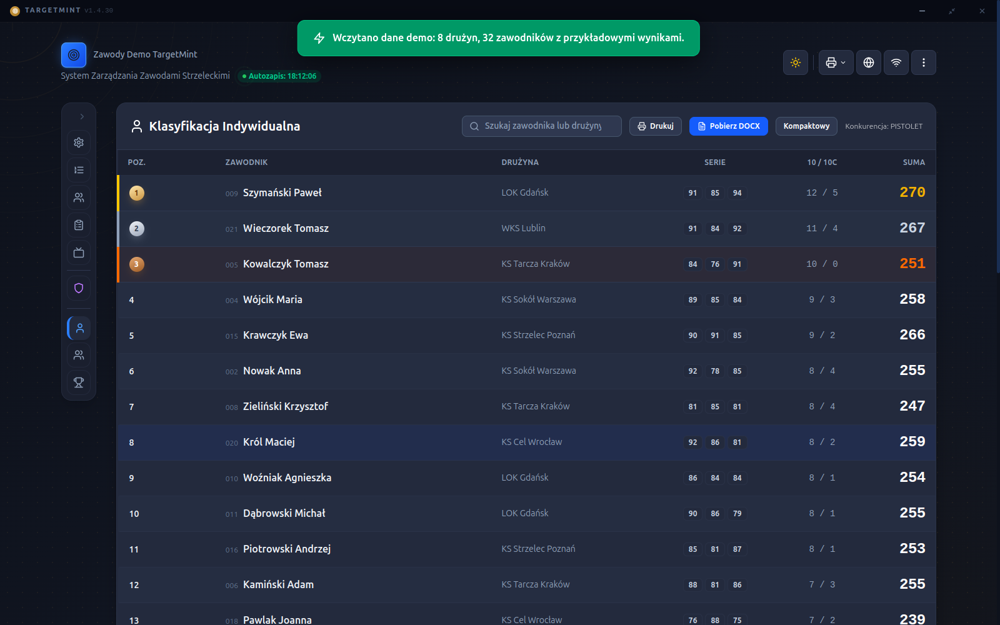
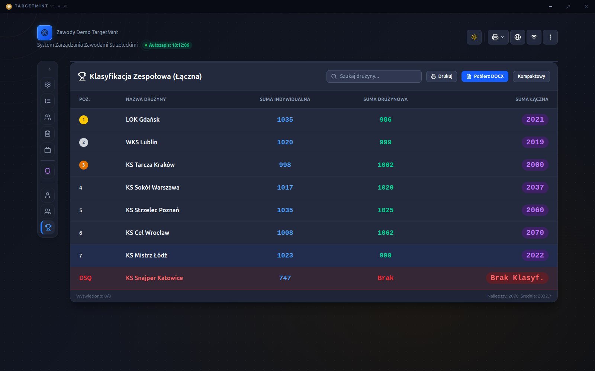
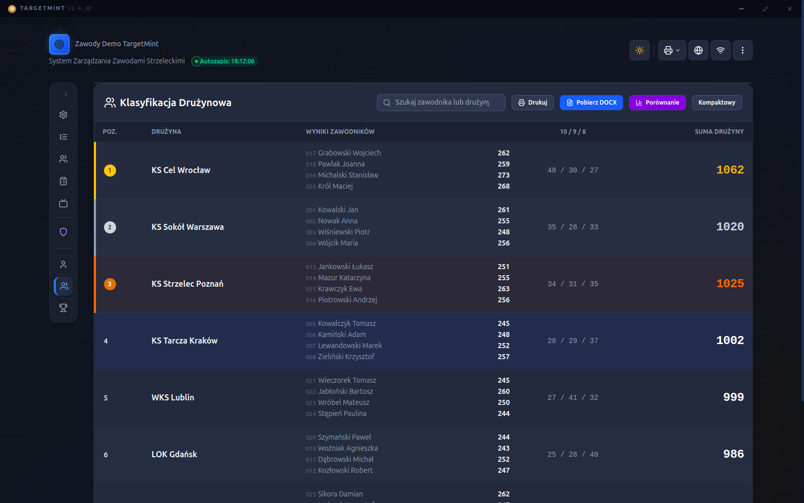
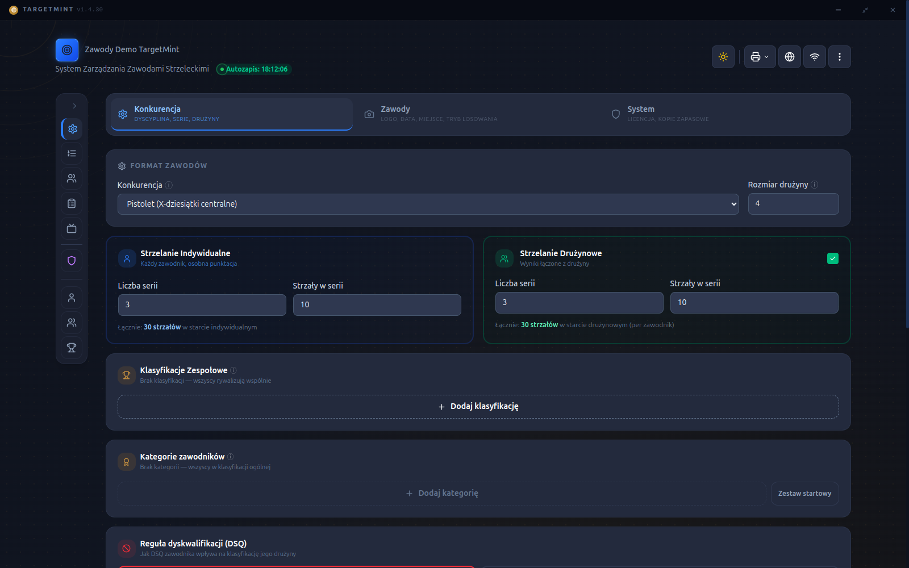

# TargetMint

**System Zawodów Strzeleckich** — aplikacja desktopowa do organizacji i prowadzenia
zawodów strzeleckich (pistolet / karabinek) w jednostkach wojskowych i klubach
strzeleckich. Od losowania i wprowadzania wyników, przez klasyfikacje
indywidualne/drużynowe/zespołowe, po oficjalne dokumenty wyników — w jednym miejscu.

Interfejs w całości po polsku. Dostępna na **Windows** i **Linux**.

## Co potrafi

- **Kreator zawodów** — konfiguracja dyscypliny, liczby serii i strzałów,
  strzelania indywidualnego i drużynowego, wielopoziomowych klasyfikacji
  zespołowych oraz kategorii zawodników (wiek, płeć, stopień itp.).
- **Szybkie wprowadzanie wyników** — pełna obsługa z klawiatury, tryb
  wprowadzania seryjnego, podgląd rozkładu strzałów na żywo.
- **Klasyfikacje** — indywidualna, drużynowa i zespołowa (łączona), z
  automatyczną propagacją dyskwalifikacji (DSQ zawodnika → wpływ na wynik
  drużyny/zespołu wg wybranej reguły) i wsparciem dla dogrywek.
- **Oficjalne dokumenty** — generowanie protokołów wyników i Komunikatu
  Końcowego w formacie DOCX, gotowych do wydruku i podpisu.
- **Live View** — widok wyników na żywo na rzutniku/telebimie: podium,
  tabela indywidualna, tabela drużynowa, wielopanelowa klasyfikacja
  zespołowa — z automatycznym obrotem widoków.
- **Publiczny podgląd wyników** — osobna, mobilna strona z wynikami na
  żywo do udostępnienia zawodnikom i kibicom (bez instalacji, w przeglądarce).
- **Baza zawodników** i historia startów między zawodami, log audytu
  zmian wyników, automatyczne kopie zapasowe, szyfrowanie danych w
  spoczynku (opcjonalne, chronione hasłem).

## Zrzuty ekranu

| Lista startowa i losowanie | Wprowadzanie wyników |
|---|---|
|  |  |

| Klasyfikacja indywidualna | Klasyfikacja zespołowa (łączona) |
|---|---|
|  |  |

| Klasyfikacja drużynowa | Konfiguracja zawodów |
|---|---|
|  |  |

## Pobieranie

Aktualne wersje instalacyjne (Windows `.exe`, Linux `.deb`/`.AppImage`) są
dostępne w zakładce **[Releases](../../releases)** tego repozytorium —
wybierz najnowszą wersję i pobierz plik dla swojego systemu.

- **Windows**: uruchom instalator `.exe` i postępuj zgodnie z kreatorem.
- **Linux**: zainstaluj pakiet `.deb` (`sudo dpkg -i nazwa-pliku.deb`) albo
  uruchom `.AppImage` bezpośrednio (nie wymaga instalacji).

Aplikacja przy pierwszym uruchomieniu poprosi o aktywację licencji.

## Licencja

Oprogramowanie własnościowe. W sprawie licencji i wdrożenia — kontakt z autorem.
